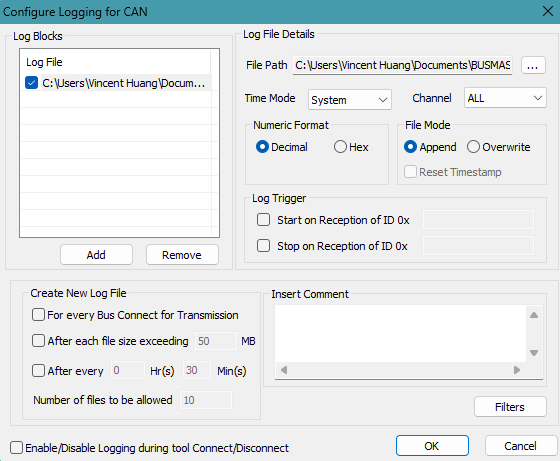
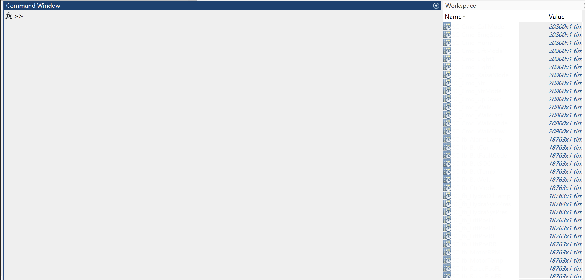

# BUSMASTER CAN Log Decoder (MATLAB)
MATLAB script for decoding **BUSMASTER CAN log files** using **DBC signal definitions**.  
Each decoded signal is exported to the MATLAB base workspace as an individual **timetable**.

This tool is designed for **interactive MATLAB workflows**, allowing quick analysis and visualization of CAN signals recorded by BUSMASTER.

---

# Features

- Parse BUSMASTER `.log` CAN recordings
- Parse `.dbc` CAN database files
- Support **Intel (@1)** and **Motorola (@0)** signal encoding
- Decode CAN payload into physical signal values using DBC definitions
- Automatically export each signal as a **MATLAB timetable**
- Signal variable names follow **DBC signal names**

- ---

# Requirements

- MATLAB (tested with R2021a)
- BUSMASTER CAN log file
- DBC file describing CAN messages

- ---

# BUSMASTER Logging Configuration

When recording logs in **BUSMASTER**, ensure the following settings:

**Numeric Format must be set to Decimal**
Example BUSMASTER logging configuration:



Otherwise the script will not correctly parse CAN IDs and payload bytes.


---

# Usage

Edit the script and specify your log and DBC files:

```matlab
logFile = "CAN_Test_260311.log";
dbcFile = "CAN_BusMasterVer2.dbc";
```
Then simply run the script in MATLAB
The script will:
1. Parse the BUSMASTER log file
2. Parse the DBC file
3. Decode CAN signals
4. Export each signal as a timetable in the MATLAB base workspace

# Example Output

After running the script, each decoded signal will appear in the MATLAB **Workspace** as a timetable.

Example MATLAB workspace:


